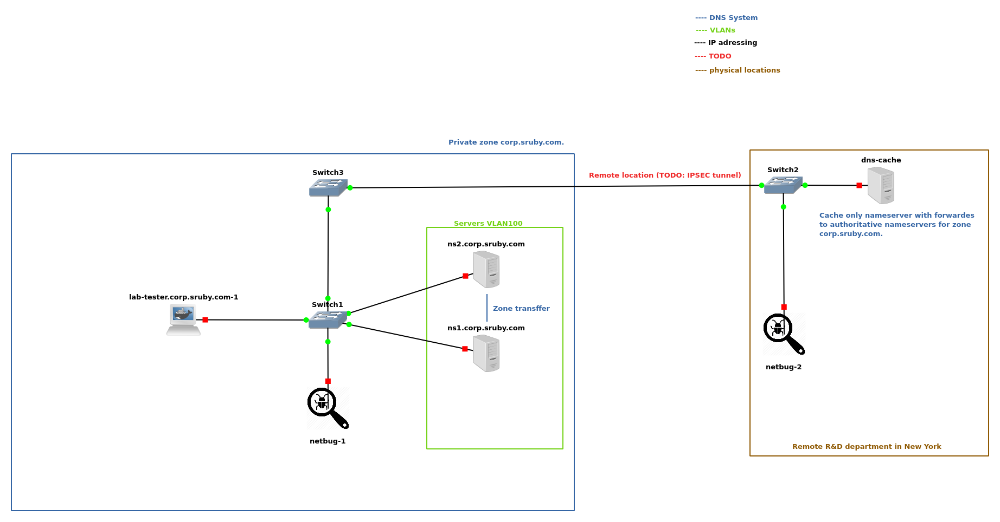

# netsec-lab
A network security lab representing an enterprise network.

### TODO:
#### DNS
- create hidden master and put it into restricted VLAN only for IT admins
- create private subdomain sth.corp.sruby.com that will be deleageted to a separate nameserver
#### DHCP
- get a DHCP server running
#### Replace default switches with Cisco L2 and L3
#### Active Directory
#### Network monitoring (Security Onion?)
#### Vulnerability scanners (Nessus?)
